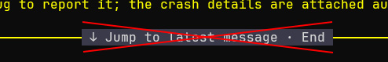

# pi-hide-jump-to-latest

Hide the fullscreen "Jump to latest message" overlay in [Pi](https://pi.dev).



In fullscreen mode, Pi shows that banner when the transcript is not scrolled to the bottom. This extension removes the banner. The End key still jumps to the latest message.

Requires Pi 0.85.0 or later. This is unofficial: it patches private TUI internals and may stop working after a Pi update.

## Install

```bash
pi install npm:pi-hide-jump-to-latest
```

Restart Pi after installing.

From git:

```bash
pi install git:github.com/theLittleStone/pi-hide-jump-to-latest
```

## Uninstall

```bash
pi remove npm:pi-hide-jump-to-latest
```

If you installed from git:

```bash
pi remove git:github.com/theLittleStone/pi-hide-jump-to-latest
```

Restart Pi after uninstall. `/reload` does not undo the patch.
